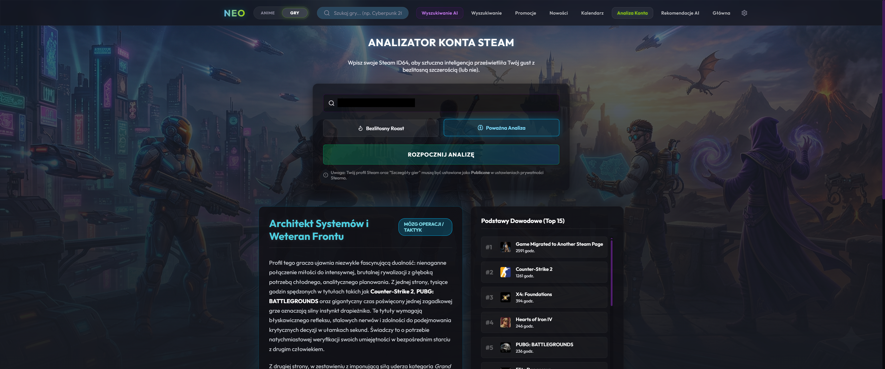

# Neo Search (Anime & Games) 🌌🎮

Nowoczesna aplikacja desktopowa (Electron) oraz webowa (Vite) służąca jako zaawansowana wyszukiwarka japońskiej popkultury oraz gier wideo, zasilana przez potężne wsparcie Sztucznej Inteligencji (LLM).

Głównym założeniem projektu jest stworzenie szybkiego, zjawiskowego centrum eksploracji rozrywki, dając możliwość m.in błyskawicznego podglądu informacji, generowania opinii, zaawansowanego podpowiadania tytułów za pomocą modelu językowego oraz asystenta rekomendującego pozycje pod unikalne DNA Gracza.

## Zrzuty Ekranu

### Sekcja Anime

| Widok | Podgląd |
|---|---|
| **Strona Główna Anime** |  |
| **Szczegóły Anime (Bento Box)** |  |
| **Moja Lista + Analiza AI** |  |
| **Wyszukiwanie AI** |  |
| **Filtrowanie i Gatunki** |  |

### Sekcja Gier

| Widok | Podgląd |
|---|---|
| **Strona Główna Gier** |  |
| **Szczegóły Gry (Bento)** |  |
| **Rekomendacje AI** |  |
| **Profil Gracza (Roast/DNA)** |  |
| **Wyszukiwanie AI Gier** |  |

## 🚀 Technologie

Projekt zbudowany jest w oparciu o szybkie, wydajne i nowoczesne rozwiązania:

- **Środowisko:** Node.js, Electron (via `electron-vite`) z pełnym wsparciem Strict Sandbox Security
- **Frontend:** React 19 (TypeScript), `react-router-dom`
- **Styling:** Vanilla CSS, autorski system designu "Glassmorphism & Neon" z dynamicznymi motywami (Cyjan dla Anime, Zieleń dla Gier)
- **Zarządzanie stanem offline & Cache:** wbudowana i zoptymalizowana lokalna baza SQL dzięki modułowi `better-sqlite3` (ukryta w procesie Main, bezpiecznie tunelowana przez IPC do zapisu tłumaczeń, historii i ocen profilowych użytkownika)
- **Sieć:** Electron `net.fetch` zintegrowany z backendem IPC, zdolny do omijania restrykcyjnych osłon Anty-Bot (np. Cloudflare) i barier CORS ze strumieniowaniem.

## 📡 Używane API i Źródła

- **Steam API & SteamSpy:** Świeże i dokładne metadane o grach PC, asynchroniczna integracja statystyk CCU (Aktywni Gracze w tym momencie) i list bestsellerów.
- **AniList GraphQL API:** Serce sekcji anime odpytywane autorskimi kwerendami dociągającymi m.in logikę Sezonów, Relacji (Franchise/Prequel/Sequel), Obsady czy Dat.
- **OpenRouter (AI Assistant):** Moduł potężnego asystenta wykorzystujący m.in. model `google/gemini-3.1-pro-preview` i `google/gemini-3-flash-preview` do inteligentnego przetwarzania fabuły, analizy bibliotek z grami, rerankingu hitów oraz tworzenia podsumowań recenzji w pigułce z użyciem wymuszonych schematów JSON.
- **Jikan API (MyAnimeList):** Asynchroniczna integracja ze scraperami MAL załadowana paginacyjnymi podzbiórkami, docelowo dostarczająca autentyczne oceny per odcinek.

## ✨ Główne Funkcje (Feature list)

- **AI Discovery & Gamer DNA:** Potężny system hybrydowy analizujący bazę ~100 tagów Steam i ekstrahujący parametry z zapytań użytkownika. Profil z 50 najogrywaniejszymi tytułami gracza może posłużyć by wygenerować jemu unikalny "Roast" profilu i rekomendować pasujące idealnie pod jego gusta inne produkcje ubrane w personalizowany werdykt.
- **Moja Lista Anime (Hub Ulubionych):** Spersonalizowany panel pozwalający na zaawansowane śledzenie oglądanych animacji. Użytkownik ma pełną kontrolę nad statusem (Oglądane, Porzucone, itp.), ocenami (1-10) i progresem odcinków (z limitem w formacie X/Y). Posiada wbudowany boczny panel **"Analiza Listy"** – moduł AI generujący unikalny profil fana anime na podstawie całej listy tytułów (oceny, gatunki, statusy, postęp). Panel dynamicznie zmienia stany: duży przycisk → spinner ładowania → kompaktowy pasek z przewijalną treścią profilu. Zwieńczony wbudowanym u góry dashboardem statystycznym Recharts (wykresy kołowe statusów i gatunków z legendą, słupkowy rozkład ocen) w stylistyce Neon. Automatycznie detekuje środowisko przełączając zapis między bazą SQLite (aplikacja Desktop) a widokiem LocalStorage (przeglądarka).
- **Moduł Gier Steam na sterydach:** Przeszukiwanie sklepu z podziałem na ceny (darmowe, do 30 PLN, 60+ PLN), widoki kalendarzowe nadchodzących gier, kategoryzowanie po blisko 40 odrębnych dokładnych gatunkach oraz "Infinite Scroll" na potężnych bibliotekach tysięcy kart bez mulenia komputera. Dynamiczny fallback miniaturek ładujący kapsułki ratunkowe w razie braku materiałów CDN od deweloperów.
- **Inteligentny Navbar:** Dynamicznie adaptujący się pasek rozwijany nawigujący pomiędzy przestrzeniami (Neon Anime / Szmaragdowe Gry), animowany zaawansowanym trybem pigułki.
- **Anime Details (Zakładkowo-Bento-Kartowe):** Zoptymalizowany pod minimalne przewijanie interfejs informacyjny: Informacje, Odcinki, Obsada i Statystyki - ukryte w pięknej szklistej siatce *Bento Box* ze wsparciem interaktywnych analitycznych wykresów.

## � Klucze API i Konfiguracja

Aplikacja korzysta z zewnętrznych serwisów wymagających kluczy API. Część funkcji działa bez klucza (publiczne endpointy), ale dla pełnego doświadczenia zalecane jest ich skonfigurowanie.

### OpenRouter (Sztuczna Inteligencja) — **Zalecany**

- **Do czego służy:** Wyszukiwanie anime/gier po opisie, generowanie werdyktów AI, tłumaczenie opisów, Analiza Listy (profil fana), Gamer DNA, Roast profilu.
- **Skąd pobrać:** Zarejestruj się na [openrouter.ai](https://openrouter.ai), przejdź do zakładki **Keys** i wygeneruj nowy klucz.
- **Gdzie wpisać:** W aplikacji kliknij ikonę ⚙️ (Ustawienia) w prawym górnym rogu Navbara i wklej klucz w pole „OpenRouter API Key".
- **Koszt:** Dostępne są **darmowe modele** (np. `google/gemini-2.5-flash-free`). Przy korzystaniu z modeli płatnych (np. `gemini-3.1-pro-preview`) opłaty naliczane są per token — szczegóły na stronie OpenRouter.

### Steam Web API Key — **Opcjonalny**

- **Do czego służy:** Skanowanie publicznej biblioteki gracza (Top 50 gier) na potrzeby Gamer DNA, personalizacji werdyktów AI oraz Roastu profilu Steam.
- **Skąd pobrać:** Zaloguj się na [steamcommunity.com/dev/apikey](https://steamcommunity.com/dev/apikey) i zarejestruj domenę (może być dowolna, np. `localhost`).
- **Gdzie wpisać:** W ustawieniach aplikacji (⚙️) w polu „Steam API Key".

> [!NOTE]
> Bez klucza Steam API większość funkcji (wyszukiwanie gier, szczegóły, rekomendacje) działa normalnie — korzystają one z publicznych endpointów Steam Store i SteamSpy. Klucz jest potrzebny wyłącznie do funkcji skanujących **prywatną bibliotekę gracza**.

### AniList API

- Klucz **nie jest wymagany**. AniList GraphQL API jest w pełni publiczne i nie wymaga rejestracji ani tokenu.

---

## ⚠️ Limity Zapytań (Rate Limits)

Przy intensywnym korzystaniu z aplikacji mogą wystąpić tymczasowe blokady ze strony zewnętrznych API. Poniżej znajdują się znane ograniczenia:

| Serwis | Limit | Objaw przekroczenia | Rozwiązanie |
|---|---|---|---|
| **AniList GraphQL** | ~90 zapytań / minutę | Błąd HTTP 429 (Too Many Requests) | Odczekaj ~60 sekund. Limit resetuje się automatycznie. |
| **Jikan (MAL)** | ~3 zapytania / sekundę | Błąd HTTP 429 | Wbudowany mechanizm opóźnień (`delay`) minimalizuje ryzyko. Przy bardzo długich seriach (500+ odc.) ładowanie ocen może trwać dłużej. |
| **Steam Store API** (publiczne) | ~200 zapytań / 5 minut | Błąd HTTP 429 lub puste odpowiedzi | Limit dotyczy IP. Odczekaj kilka minut. Najczęściej występuje przy masowym ładowaniu szczegółów gier. |
| **Steam Web API** (z kluczem) | ~100 000 zapytań / dzień | Blokada klucza na 24h | Przy normalnym użytkowaniu limit jest praktycznie nieosiągalny. |
| **SteamSpy** | ~4 zapytania / sekundę | Puste odpowiedzi lub timeout | Odczekaj kilka sekund między kolejnymi operacjami. |
| **OpenRouter** (darmowe modele) | Zależy od modelu (~20-50 / minutę) | Błąd 429 lub komunikat o limicie | Odczekaj chwilę lub przejdź na model płatny. Własny klucz API znacząco zwiększa limity. |

> [!TIP]
> Aplikacja posiada wbudowane mechanizmy **cache'owania** (baza SQLite dla tłumaczeń, recenzji AI i profili) oraz **opóźnień między zapytaniami** (Jikan). Przy normalnym użytkowaniu limity te nie powinny stanowić problemu.

## �🛠️ Instalacja i Uruchomienie

### Wymagania

- Node.js (serwer Node oraz npm)
- Opcjonalnie: Prywatny klucz OpenRouter wpisany w ustawienia programu dla zniesienia limitów LLM'a.

### Szybki start deweloperski

```bash
# Sklonuj repo
$ git clone [url-repo]

# Zainstaluj zależności
$ npm install

# Uruchom bezpośrednio środowisko deweloperskie przeglądarkowe z dostępem do sieci LAN:
$ npm run dev:web

# LUB Uruchom bezpośrednio środowisko deweloperskie natywnego Electrona:
$ npm run dev
```

### Budowanie Edycji Produkcyjnej (Deploy)

Aplikacja ma restrykcyjnie włączoną ochronę `sandbox: true` i pakuje się jako zamknięty, nietykalny plik wykonywalny ze wbudowanym oknem Chromium. Omija on weryfikacje CORS przeglądarek przy strzałach na serwery zewnętrze.

> **Uwaga dotycząca prywatności i danych:** Po pierwszym uruchomieniu zbudowanej aplikacji, system operacyjny automatycznie wygeneruje lokalny folder z prywatnymi danymi użytkownika (historia wyszukiwań, ulubione pozycje, klucze API oraz lokalna baza SQLite). 
> Domyślna lokalizacja plików na systemie Windows to: `%APPDATA%\anime-search-app` (np. `C:\Users\[Twój_User]\AppData\Roaming\anime-search-app`).

```bash
# Budowanie Instalatora oraz .exe (Windows)
$ npm run build:win

# Budowanie dla Linuxa (.AppImage / .deb)
$ npm run build:linux
```
